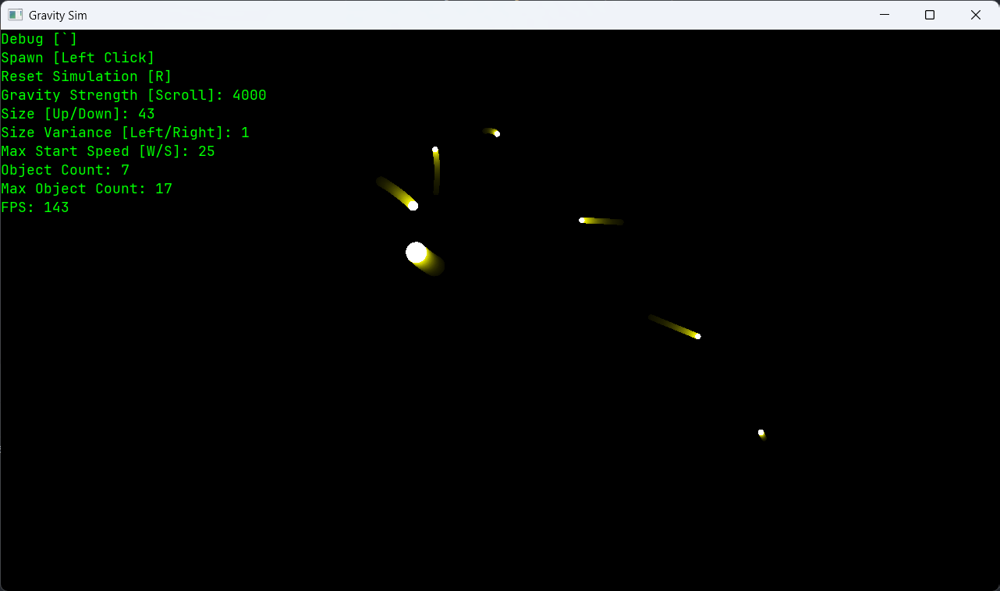

# Gravity Sim

A C++ gravity simulator.



## Details
* Click on the screen to add a new object.
* <kbd>`</kbd>To toggle debug info.
* <kbd>R</kbd>To reset the simulation.
* Scroll to change the gravity strength.
* <kbd>&uparrow;</kbd>/<kbd>&downarrow;</kbd>
To change the object spawn size.
* <kbd>&leftarrow;</kbd>/<kbd>&rightarrow;</kbd>
To change the variance in spawn size.
* <kbd>W</kbd>/<kbd>D</kbd> To change the maximum
speed an object will spawn with.
* Objects merge when they overlap.
* Internally stores objects with SOA rather
AOS for better cache performance.
* Built with SFML.
* Uses the brute force algorithm (O(N^2))
to calculate everything, so might not be the
most efficient. I do plan on eventually using
SIMD instructions to make this faster which is
another reason why a SOA data structure is being
used for the objects.

## Cloning/Running
### Clone
```shell
git clone "https://github.com/Alex-Petrucci/GravitySim"
```

### Build
This project uses CMake so build use the
compiler/build system of your choice.

Before building, you might want to configure 
some things in [Config.hpp](src/Config.hpp). The defaults
are just what I think looks good on my PC.
The one most people will probably want to change 
is the `FPS_CAP` which has been set to 144hz 
as that is what my monitor can display.

### Run
Just run the executable produced by the build.